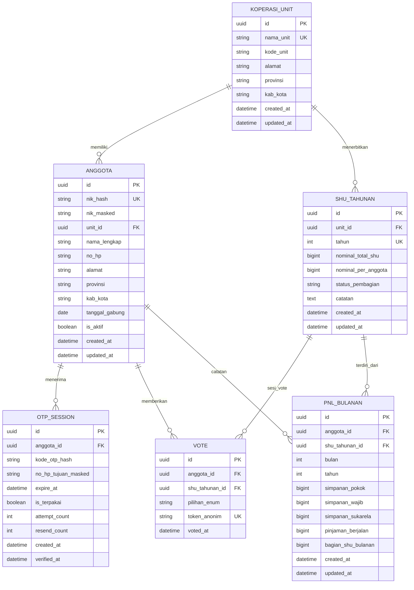

# ERD - Database Sistem SHU KDKMP Kasihan Bantul
Versi: 1.0
Tanggal: 2026-08-18

---

## 1. Diagram (Mermaid Syntax)

---

## 2. Penjelasan Setiap Tabel

### 2.1 `KOPERASI_UNIT`
Unit-unit KDKMP di berbagai wilayah (contoh: KDKMP Genteng, KDKMP Sukamaju, dll).

| Kolom | Tipe | Keterangan |
|---|---|---|
| `id` | uuid | Primary key |
| `nama_unit` | string | Nama unit koperasi (unique key) |
| `kode_unit` | string | Kode internal unit |
| `alamat` | string | Alamat lengkap unit |
| `provinsi` | string | Nama provinsi unit |
| `kab_kota` | string | Nama kabupaten/kota unit |
| `created_at` / `updated_at` | datetime | Audit timestamp |

---

### 2.2 `ANGGOTA`
Data anggota koperasi (identitas disamarkan untuk keamanan).

| Kolom | Tipe | Keterangan |
|---|---|---|
| `id` | uuid | Primary key |
| `nik_hash` | string | **Hash SHA-256 NIK** (UNIQUE, TIDAK PERNAH simpan NIK mentah) |
| `nik_masked` | string | NIK disamarkan (contoh: `************3821`) untuk ditampilkan di UI |
| `unit_id` | uuid | Foreign key ke `KOPERASI_UNIT` |
| `nama_lengkap` | string | Nama anggota (contoh: "Ibu Wati") |
| `no_hp` | string | Nomor HP tujuan SMS OTP (hash atau enkripsi di production) |
| `alamat` | string | Alamat anggota |
| `provinsi` | string | Provinsi domisili |
| `kab_kota` | string | Kab/Kota domisili |
| `tanggal_gabung` | date | Tanggal anggota bergabung |
| `is_aktif` | boolean | Status keaktifan anggota (bisa vote atau tidak) |
| `created_at` / `updated_at` | datetime | Audit timestamp |

**Catatan Keamanan:**
- NIK ASLI TIDAK PERNAH disimpan ke DB, HANYA hash + salt
- Saat login: user masukkan NIK → hash di backend → cocokkan dengan `nik_hash`
- `nik_masked` hanya untuk tampilan di UI

---

### 2.3 `OTP_SESSION`
Riwayat pengiriman dan verifikasi OTP per upaya login.

| Kolom | Tipe | Keterangan |
|---|---|---|
| `id` | uuid | Primary key |
| `anggota_id` | uuid | Foreign key ke `ANGGOTA` |
| `kode_otp_hash` | string | Hash OTP 6 digit (TIDAK simpan OTP mentah) |
| `no_hp_tujuan_masked` | string | Nomor HP disamarkan untuk UI |
| `expire_at` | datetime | Waktu kadaluarsa OTP (default: +5 menit dari created_at) |
| `is_terpakai` | boolean | Apakah OTP sudah dipakai verifikasi |
| `attempt_count` | int | Jumlah percobaan input salah (max 5 → blokir 15 menit) |
| `resend_count` | int | Jumlah kirim ulang (max 3 per NIK per jam) |
| `created_at` | datetime | Waktu OTP dibuat/dikirim |
| `verified_at` | datetime | Waktu OTP berhasil diverifikasi (jika sukses) |

**Business Rule:**
- 1 NIK maksimal 3 OTP session aktif dalam 1 jam
- Countdown resend 3 menit di UI mengacu pada `created_at` session terakhir

---

### 2.4 `SHU_TAHUNAN`
Data SHU per tahun per unit koperasi.

| Kolom | Tipe | Keterangan |
|---|---|---|
| `id` | uuid | Primary key |
| `unit_id` | uuid | Foreign key ke `KOPERASI_UNIT` |
| `tahun` | int | Tahun SHU (UNIQUE per unit) |
| `nominal_total_shu` | bigint | Total SHU unit tahun ini (Rupiah) |
| `nominal_per_anggota` | bigint | Estimasi per anggota (bisa dihitung ulang) |
| `status_pembagian` | enum | `DRAFT` / `VOTING` / `DISETUJUI` / `DIBAGIKAN` |
| `catatan` | text | Catatan tambahan |
| `created_at` / `updated_at` | datetime | Audit timestamp |

---

### 2.5 `VOTE`
Data hasil voting anggota per sesi SHU tahunan.
**PRINSIP RAHASIA:** `pilihan` hanya bisa dihubungkan ke anggota via admin internal, untuk laporan publik hanya aggregate dengan `token_anonim`.

| Kolom | Tipe | Keterangan |
|---|---|---|
| `id` | uuid | Primary key |
| `anggota_id` | uuid | Foreign key ke `ANGGOTA` (hanya untuk cek "sudah vote / belum") |
| `shu_tahunan_id` | uuid | Foreign key ke `SHU_TAHUNAN` |
| `pilihan_enum` | enum | `SETUJU` / `TIDAK_SETUJU` |
| `token_anonim` | string | Token random UNIQUE (digunakan untuk laporan publik aggregate, tanpa keterkaitan NIK) |
| `voted_at` | datetime | Waktu vote dicatat |

**Aturan:**
- `UNIQUE(anggota_id, shu_tahunan_id)` → 1 NIK hanya 1 suara per tahun
- Laporan publik: Hanya hitung count `SETUJU` / `TIDAK_SETUJU` + `token_anonim`, tanpa JOIN ke `ANGGOTA`

---

### 2.6 `PNL_BULANAN`
Catatan simpanan, pinjaman, dan bagian SHU per anggota per bulan.

| Kolom | Tipe | Keterangan |
|---|---|---|
| `id` | uuid | Primary key |
| `anggota_id` | uuid | Foreign key ke `ANGGOTA` |
| `shu_tahunan_id` | uuid | Foreign key ke `SHU_TAHUNAN` |
| `bulan` | int | 1-12 |
| `tahun` | int | Tahun |
| `simpanan_pokok` | bigint | Rupiah |
| `simpanan_wajib` | bigint | Rupiah |
| `simpanan_sukarela` | bigint | Rupiah |
| `pinjaman_berjalan` | bigint | Sisa pinjaman (Rupiah) |
| `bagian_shu_bulanan` | bigint | Estimasi bagian SHU bulan ini |
| `created_at` / `updated_at` | datetime | Audit timestamp |

**Aturan:**
- `UNIQUE(anggota_id, bulan, tahun)` → 1 baris per anggota per bulan

---

## 3. Relasi Utama

| Relasi | Cardinality | Penjelasan |
|---|---|---|
| KOPERASI_UNIT → ANGGOTA | 1 to N | 1 unit punya banyak anggota |
| KOPERASI_UNIT → SHU_TAHUNAN | 1 to N | 1 unit terbitkan SHU tahunan tiap tahun |
| ANGGOTA → OTP_SESSION | 1 to N | 1 anggota punya banyak session OTP |
| ANGGOTA → VOTE | 1 to N | 1 anggota vote tiap tahun |
| SHU_TAHUNAN → VOTE | 1 to N | 1 SHU tahunan = banyak suara |
| ANGGOTA → PNL_BULANAN | 1 to N | 1 anggota punya catatan bulanan |
| SHU_TAHUNAN → PNL_BULANAN | 1 to N | 1 SHU tahunan = 12 catatan bulanan |

---

## 4. Index yang Disarankan

| Tabel | Index | Kegunaan |
|---|---|---|
| ANGGOTA | `nik_hash` | Cek NIK saat login (UNIQUE) |
| OTP_SESSION | `(anggota_id, created_at DESC)` | Cari OTP terbaru anggota |
| VOTE | `(anggota_id, shu_tahunan_id)` | Cek "sudah vote / belum" (UNIQUE) |
| VOTE | `(shu_tahunan_id, pilihan_enum)` | Hitung aggregate hasil voting |
| PNL_BULANAN | `(anggota_id, tahun, bulan)` | Query PNL bulanan anggota |
